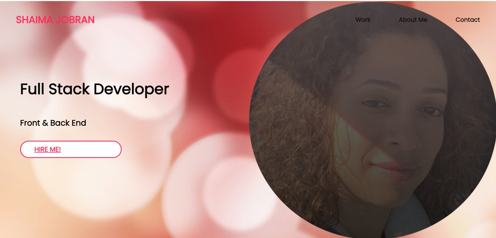
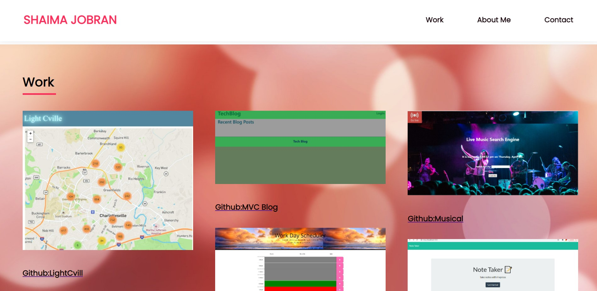
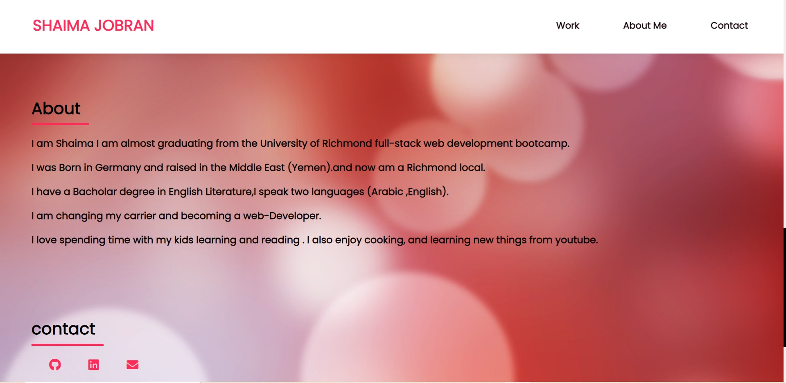

## Updated-Portfolio-3
## License
 

This an updated portfolio page and other materials to build toward being employer-competitive.

## Requirements

* Updated portfolio featuring at least 3 examples of student work from either deployed projects of homeworks

* Update GitHub profile with pinned repositories featuring at least 3 examples of student work from either deployed projects of homeworks

* Updated resume

* Updated LinkedIn profile

##

# screenshots

## Links
[linkedIn](https://www.linkedin.com/in/shaima-jobran-323472172/)

[Github](https://github.com/shaimajobran)

[Resume](images/Resume.pdf)

## Contact
If you have any questions about the repo, contact me at [shaimajobran](https://github.com/shaimajobran).

